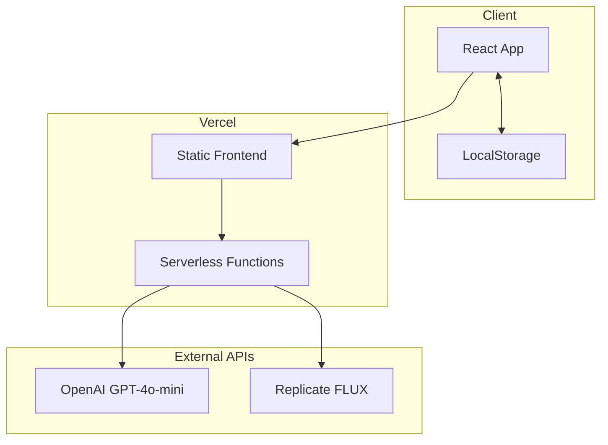

# CineLife Implementation Plan

**Version:** 1.0
**Date:** 2026-02-24
**Status:** Ready for Implementation
**Based on:** Complete business plan and technical architecture documents

---

## Overview

This document provides a detailed implementation plan for CineLife - an AI-powered "life to movie" generator. The plan is organized into phases with specific tasks, deliverables, and acceptance criteria.

### Project Summary

- **Product:** Web app that transforms user's life story into a cinematic experience
- **Tech Stack:** React + Vite + Tailwind CSS, Vercel hosting, OpenAI + Replicate APIs
- **Timeline:** 4 weeks to MVP launch
- **Budget:** $0 (using free-tier services)

---

## Architecture Overview



---

## Phase 1: Project Foundation

### 1.1 Project Setup

**Tasks:**
- [ ] Initialize Vite + React project
- [ ] Configure TypeScript
- [ ] Set up Tailwind CSS
- [ ] Configure ESLint and Prettier
- [ ] Set up folder structure per technical architecture
- [ ] Create environment variables template

**Deliverables:**
```
cinelife/
├── public/
│   ├── favicon.ico
│   └── og-image.png
├── src/
│   ├── components/
│   │   ├── ui/
│   │   ├── layout/
│   │   ├── features/
│   │   └── screens/
│   ├── hooks/
│   ├── services/
│   ├── utils/
│   ├── styles/
│   └── App.jsx
├── api/
├── package.json
├── vite.config.js
├── tailwind.config.js
└── .env.example
```

**Acceptance Criteria:**
- `npm run dev` starts development server
- Tailwind classes work correctly
- ESLint runs without errors
- Project structure matches architecture spec

### 1.2 Design System Implementation

**Tasks:**
- [ ] Create CSS custom properties for colors
- [ ] Implement typography scale
- [ ] Create spacing system
- [ ] Build base UI components:
  - [ ] Button (primary, secondary, ghost variants)
  - [ ] Input (text, textarea, select)
  - [ ] Card component
  - [ ] Progress indicator
  - [ ] Loading spinner/animation

**Design Tokens:**
```css
/* Colors */
--color-gold: #D4AF37;
--color-deep-red: #8B0000;
--color-midnight: #0D0D0D;
--color-silver: #C0C0C0;
--color-velvet: #1A1A2E;

/* Typography */
--font-primary: 'Poppins', sans-serif;
--font-secondary: 'Inter', sans-serif;

/* Spacing */
--space-1: 0.25rem;  /* 4px */
--space-2: 0.5rem;   /* 8px */
--space-4: 1rem;     /* 16px */
--space-6: 2rem;     /* 32px */
```

**Acceptance Criteria:**
- All color tokens defined and working
- Typography scale implemented
- All base components render correctly
- Components are accessible (focus states, ARIA)

---

## Phase 2: Core Features

### 2.1 Landing Page

**Tasks:**
- [ ] Create Header component with logo
- [ ] Build Hero section with:
  - [ ] Value proposition headline
  - [ ] Subheadline explaining the product
  - [ ] Primary CTA button
  - [ ] Example movie poster display
- [ ] Add example outputs carousel
- [ ] Create social proof section
- [ ] Implement Footer
- [ ] Add responsive design for mobile

**Wireframe Reference:**
```
┌─────────────────────────────────────┐
│  LOGO                    [Create]   │
├─────────────────────────────────────┤
│                                     │
│     ★ YOUR LIFE. THE MOVIE. ★      │
│                                     │
│   Transform your story into a      │
│   cinematic masterpiece in 5 mins  │
│                                     │
│        [🎬 Create Your Movie]      │
│                                     │
│   ┌─────────┐ ┌─────────┐ ┌─────┐ │
│   │ Poster  │ │ Poster  │ │ ... │ │
│   │ Example │ │ Example │ │     │ │
│   └─────────┘ └─────────┘ └─────┘ │
└─────────────────────────────────────┘
```

**Acceptance Criteria:**
- Page loads in <2 seconds
- CTA button is prominent and clickable
- Mobile responsive (375px - 1440px)
- Lighthouse score >90

### 2.2 Input Wizard

**Tasks:**
- [ ] Create wizard container with progress bar
- [ ] Implement Step 1: Basic Info
  - [ ] Name input (required)
  - [ ] Age input (required)
- [ ] Implement Step 2: Life Events
  - [ ] Key events textarea (required)
  - [ ] Biggest challenge textarea
  - [ ] Proudest achievement textarea
- [ ] Implement Step 3: Details
  - [ ] Current goal input
  - [ ] Important people input
- [ ] Implement Step 4: Mood/Genre
  - [ ] Mood selection dropdown
  - [ ] Review and edit capability
- [ ] Add navigation (back/continue buttons)
- [ ] Implement form validation
- [ ] Add localStorage persistence

**State Structure:**
```javascript
const wizardState = {
  currentStep: 1,
  totalSteps: 4,
  userInput: {
    name: '',
    age: null,
    events: [],
    challenge: '',
    achievement: '',
    goal: '',
    people: [],
    mood: ''
  },
  isValid: false
};
```

**Acceptance Criteria:**
- Progress bar updates correctly
- Required field validation works
- Can navigate back to edit
- Data persists on page refresh
- Total completion time <5 minutes

### 2.3 AI Generation Service

**Tasks:**
- [ ] Create serverless function for text generation
- [ ] Create serverless function for image generation
- [ ] Implement prompt templates for:
  - [ ] Movie title
  - [ ] Logline
  - [ ] Genre classification
  - [ ] Plot summary (3-act structure)
  - [ ] Character descriptions
- [ ] Add error handling and retries
- [ ] Implement rate limiting
- [ ] Add response caching

**API Endpoints:**
```
POST /api/generate/text
  Body: { type: 'title' | 'logline' | 'plot' | 'characters', input: UserInput }
  Response: { result: string }

POST /api/generate/poster
  Body: { title: string, genre: string, plotSummary: string }
  Response: { imageUrl: string }
```

**Prompt Templates:**
```javascript
const prompts = {
  title: `Generate a compelling movie title for a story about ${name},
          a ${age}-year-old who ${events}.
          Genre: ${mood}. Return only the title.`,

  logline: `Create a one-sentence Hollywood logline for a movie about ${name}.
            Key events: ${events}.
            Challenge: ${challenge}.
            Achievement: ${achievement}.
            Format: One sentence, under 30 words.`
};
```

**Acceptance Criteria:**
- Text generation completes in <5 seconds
- Image generation completes in <30 seconds
- All API errors handled gracefully
- Rate limiting prevents abuse

### 2.4 Results Display

**Tasks:**
- [ ] Create ResultsPage component
- [ ] Build movie poster display
- [ ] Create title and logline section
- [ ] Add genre badge
- [ ] Implement expandable plot summary
- [ ] Create character descriptions section
- [ ] Add regeneration buttons
- [ ] Implement share buttons

**Layout:**
```
┌─────────────────────────────────────┐
│  ← New Movie    [Share] [Download] │
├─────────────────────────────────────┤
│   ┌───────────────────────────┐    │
│   │      MOVIE POSTER         │    │
│   │    "Finding Sarah"        │    │
│   │   A story of courage...   │    │
│   └───────────────────────────┘    │
│                                     │
│   ★ Finding Sarah ★                │
│   Genre: Drama / Coming-of-Age     │
│                                     │
│   Logline: "A young woman's..."    │
│                                     │
│   📖 Plot Summary          [▼]     │
│   👥 Characters            [▼]     │
│                                     │
│   [🔄 Regenerate Poster]           │
│                                     │
│   [TikTok] [IG] [Twitter] [Download]│
└─────────────────────────────────────┘
```

**Acceptance Criteria:**
- Poster displays prominently
- All text readable on mobile
- Expandable sections work
- Regeneration buttons functional

### 2.5 Sharing System

**Tasks:**
- [ ] Implement Web Share API integration
- [ ] Create fallback for unsupported browsers
- [ ] Build download poster functionality
- [ ] Add copy-to-clipboard for link
- [ ] Create platform-specific share buttons
- [ ] Add watermark to free tier posters
- [ ] Implement OG meta tags for link previews

**Share Options:**
- Download as PNG
- Copy link
- Share to TikTok
- Share to Instagram
- Share to Twitter

**Acceptance Criteria:**
- Download generates valid PNG file
- Share dialog opens on supported browsers
- Copy link shows success message
- Watermark visible on free tier

### 2.6 Regeneration System

**Tasks:**
- [ ] Create regeneration state management
- [ ] Implement regenerate title function
- [ ] Implement regenerate poster function
- [ ] Implement regenerate all function
- [ ] Add regeneration limit tracking
- [ ] Create UI for regeneration count
- [ ] Store previous versions for comparison

**Constraints:**
- Free tier: 2 regenerations per movie
- Show remaining regenerations
- Disable button when limit reached

**Acceptance Criteria:**
- Regeneration updates specific component
- Previous version saved for comparison
- Limit enforced correctly
- User notified of remaining regenerations

---

## Phase 3: Polish & Testing

### 3.1 Error Handling

**Tasks:**
- [ ] Create ErrorBoundary component
- [ ] Add error states for API failures
- [ ] Implement retry functionality
- [ ] Create user-friendly error messages
- [ ] Add error logging service

**Error Types:**
| Error | User Message | Recovery |
|-------|--------------|----------|
| Invalid input | "Please check your input" | Show validation |
| Rate limited | "Too many requests, try later" | Show countdown |
| AI failure | "Generation failed, retry?" | Retry button |
| Timeout | "Taking too long, retry?" | Retry button |

### 3.2 Loading States

**Tasks:**
- [ ] Create loading animation component
- [ ] Add progress steps during generation
- [ ] Implement skeleton loaders
- [ ] Add button loading states

**Loading Animation:**
```
🎬 Directing your movie...

✓ Casting characters
✓ Crafting plot
◐ Designing poster
○ Final cut
```

### 3.3 Testing

**Unit Tests:**
- [ ] Button component tests
- [ ] Input component tests
- [ ] Form validation tests
- [ ] Utility function tests
- [ ] Hook tests

**Integration Tests:**
- [ ] API endpoint tests
- [ ] AI service tests (mocked)
- [ ] State management tests

**E2E Tests:**
- [ ] Complete movie creation flow
- [ ] Sharing flow
- [ ] Regeneration flow
- [ ] Error handling flow

**Coverage Targets:**
- Unit: 80%
- Integration: 60%
- E2E: 100% critical paths

### 3.4 Performance Optimization

**Tasks:**
- [ ] Implement code splitting
- [ ] Optimize images
- [ ] Add lazy loading
- [ ] Configure caching headers
- [ ] Minimize bundle size

**Targets:**
- First Contentful Paint: <1.5s
- Largest Contentful Paint: <2.5s
- Time to Interactive: <3s
- Bundle size: <200KB

---

## Phase 4: Deployment & Launch

### 4.1 Deployment Setup

**Tasks:**
- [ ] Configure Vercel project
- [ ] Set up environment variables
- [ ] Configure custom domain
- [ ] Set up SSL certificate
- [ ] Configure CDN

**Environment Variables:**
```bash
OPENAI_API_KEY=sk-...
REPLICATE_API_TOKEN=r8_...
ANALYTICS_ID=...
```

### 4.2 Analytics Setup

**Tasks:**
- [ ] Set up Umami analytics
- [ ] Configure event tracking
- [ ] Create conversion funnels
- [ ] Set up error tracking

**Events to Track:**
- page_view
- wizard_start
- wizard_complete
- generation_start
- generation_complete
- share_click
- regenerate_click

### 4.3 Launch Preparation

**Tasks:**
- [ ] Create Product Hunt listing
- [ ] Prepare launch assets
- [ ] Write launch day content
- [ ] Set up social media accounts
- [ ] Prepare press kit

**Product Hunt Assets:**
- Hero image (1270x760)
- Gallery images (6-8)
- Demo video (<60s)
- Tagline and description

---

## File Structure

```
cinelife/
├── public/
│   ├── favicon.ico
│   ├── og-image.png
│   └── robots.txt
├── src/
│   ├── components/
│   │   ├── ui/
│   │   │   ├── Button.jsx
│   │   │   ├── Input.jsx
│   │   │   ├── Card.jsx
│   │   │   ├── Progress.jsx
│   │   │   └── Loading.jsx
│   │   ├── layout/
│   │   │   ├── Header.jsx
│   │   │   └── Footer.jsx
│   │   ├── features/
│   │   │   ├── InputWizard.jsx
│   │   │   ├── MovieDisplay.jsx
│   │   │   ├── PosterCard.jsx
│   │   │   └── ShareButtons.jsx
│   │   └── screens/
│   │       ├── LandingPage.jsx
│   │       ├── CreatePage.jsx
│   │       └── ResultsPage.jsx
│   ├── hooks/
│   │   ├── useMovieGeneration.js
│   │   └── useLocalStorage.js
│   ├── services/
│   │   ├── aiService.js
│   │   └── shareService.js
│   ├── utils/
│   │   ├── prompts.js
│   │   └── formatters.js
│   ├── styles/
│   │   └── globals.css
│   ├── App.jsx
│   └── main.jsx
├── api/
│   └── generate/
│       ├── text.js
│       └── poster.js
├── tests/
│   ├── unit/
│   ├── integration/
│   └── e2e/
├── package.json
├── vite.config.js
├── tailwind.config.js
├── vercel.json
└── .env.example
```

---

## Dependencies

### Production Dependencies
```json
{
  "react": "^18.2.0",
  "react-dom": "^18.2.0",
  "react-router-dom": "^6.20.0",
  "openai": "^4.20.0",
  "replicate": "^0.18.0"
}
```

### Development Dependencies
```json
{
  "vite": "^5.0.0",
  "tailwindcss": "^3.3.0",
  "autoprefixer": "^10.4.0",
  "postcss": "^8.4.0",
  "eslint": "^8.55.0",
  "prettier": "^3.1.0",
  "vitest": "^1.0.0",
  "@testing-library/react": "^14.1.0",
  "@playwright/test": "^1.40.0"
}
```

---

## Timeline

### Week 1: Foundation
| Day | Tasks |
|-----|-------|
| 1-2 | Project setup, design system |
| 3-4 | Landing page, input wizard UI |
| 5 | API skeleton, routing |

### Week 2: Core Features
| Day | Tasks |
|-----|-------|
| 6-7 | AI generation integration |
| 8 | Results display |
| 9 | Sharing functionality |
| 10 | Regeneration system |

### Week 3: Polish
| Day | Tasks |
|-----|-------|
| 11-12 | Error handling, loading states |
| 13-14 | Testing |
| 15 | Performance optimization |

### Week 4: Launch
| Day | Tasks |
|-----|-------|
| 16-17 | Final testing, bug fixes |
| 18 | Deployment |
| 19 | Soft launch |
| 20 | Product Hunt launch |

---

## Success Criteria

### Technical Success
- [ ] All P0 features implemented
- [ ] Test coverage meets targets
- [ ] Lighthouse score >90
- [ ] No critical bugs
- [ ] Mobile responsive

### Launch Success
- [ ] Product Hunt Top 5
- [ ] 500+ visitors day 1
- [ ] 200+ movies created
- [ ] 50+ shares
- [ ] Positive feedback

---

## Risk Mitigation

| Risk | Mitigation |
|------|------------|
| AI API limits | Implement caching, rate limiting |
| Viral spike | Queue system, graceful degradation |
| Low conversion | A/B test, gather feedback |
| Competitor | Speed to market, build brand |

---

## Next Steps

1. **Immediate:** Switch to Code mode to begin implementation
2. **Week 1:** Complete project foundation and design system
3. **Week 2:** Implement core features
4. **Week 3:** Polish and test
5. **Week 4:** Deploy and launch

---

*Implementation plan prepared based on complete business plan and technical architecture documents*
