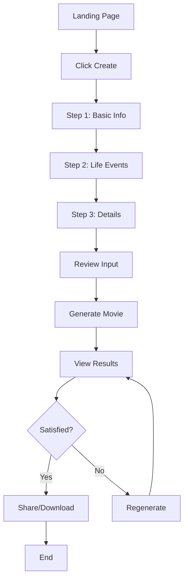
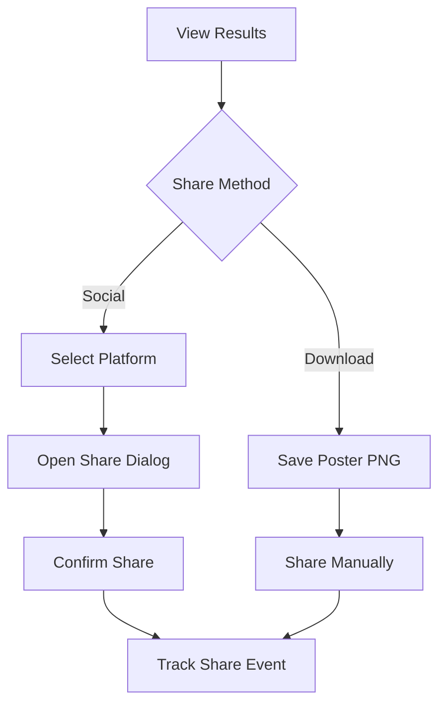
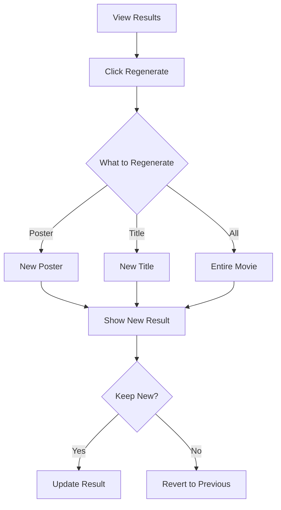

# Step 5: Design System & UI/UX Concepts

**Date:** 2026-02-23
**Status:** Completed
**Role:** UI/UX Designer
**Subject:** CineLife Design System

---

## Executive Summary

This document establishes the complete design system for CineLife, including visual identity, component library, user flows, and wireframes. The design prioritizes **mobile-first**, **cinematic aesthetic**, and **shareability**.

**Design Philosophy:** "Cinematic Magic" - Every touchpoint should feel like stepping into a movie theater.

---

## Brand Identity

### Logo Concept

**Primary Logo:**
- Film reel forming the letter "C"
- Gradient from gold to deep red
- Clean, modern sans-serif typography

**Logo Variations:**
- Full logo with wordmark
- Icon only (app icon, favicon)
- Monochrome versions

### Color Palette

#### Primary Colors
| Name | Hex | Usage |
|------|-----|-------|
| Cinema Gold | #D4AF37 | CTAs, highlights, premium |
| Deep Red | #8B0000 | Accents, drama |
| Midnight | #0D0D0D | Background, text |

#### Secondary Colors
| Name | Hex | Usage |
|------|-----|-------|
| Silver Screen | #C0C0C0 | Borders, subtle text |
| Spotlight | #FFD700 | Hover states, emphasis |
| Velvet | #1A1A2E | Card backgrounds |

#### Semantic Colors
| Name | Hex | Usage |
|------|-----|-------|
| Success | #2ECC71 | Confirmations |
| Warning | #F39C12 | Alerts |
| Error | #E74C3C | Errors |

### Typography

#### Primary Font: "Poppins"
- **Usage:** Headlines, CTAs, key text
- **Weights:** 600 (semibold), 700 (bold)
- **Rationale:** Modern, friendly, cinematic feel

#### Secondary Font: "Inter"
- **Usage:** Body text, descriptions
- **Weights:** 400 (regular), 500 (medium)
- **Rationale:** Highly readable, professional

#### Font Scale
```css
--font-size-xs: 0.75rem;    /* 12px */
--font-size-sm: 0.875rem;   /* 14px */
--font-size-base: 1rem;     /* 16px */
--font-size-lg: 1.125rem;   /* 18px */
--font-size-xl: 1.25rem;    /* 20px */
--font-size-2xl: 1.5rem;    /* 24px */
--font-size-3xl: 2rem;      /* 32px */
--font-size-4xl: 2.5rem;    /* 40px */
--font-size-hero: 3.5rem;   /* 56px */
```

### Spacing System
```css
--space-1: 0.25rem;   /* 4px */
--space-2: 0.5rem;    /* 8px */
--space-3: 0.75rem;   /* 12px */
--space-4: 1rem;      /* 16px */
--space-5: 1.5rem;    /* 24px */
--space-6: 2rem;      /* 32px */
--space-8: 3rem;      /* 48px */
--space-10: 4rem;     /* 64px */
```

### Border Radius
```css
--radius-sm: 0.25rem;   /* 4px */
--radius-md: 0.5rem;    /* 8px */
--radius-lg: 1rem;      /* 16px */
--radius-xl: 1.5rem;    /* 24px */
--radius-full: 9999px;  /* Pills */
```

### Shadows
```css
--shadow-sm: 0 1px 2px rgba(0, 0, 0, 0.1);
--shadow-md: 0 4px 6px rgba(0, 0, 0, 0.15);
--shadow-lg: 0 10px 15px rgba(0, 0, 0, 0.2);
--shadow-glow: 0 0 20px rgba(212, 175, 55, 0.3);
```

---

## Component Library

### Buttons

#### Primary Button
```
Visual: Gold background, dark text, rounded
Hover: Lighter gold, subtle glow
Active: Darker gold
Disabled: Gray, reduced opacity
```

#### Secondary Button
```
Visual: Transparent, gold border, gold text
Hover: Gold background, dark text
```

#### Ghost Button
```
Visual: Transparent, no border, white text
Hover: Subtle white background
```

### Input Fields

#### Text Input
```
Default: Dark background, silver border
Focus: Gold border, subtle glow
Error: Red border, error message below
```

#### Textarea
```
Same as text input
Min height: 100px
Resize: Vertical only
```

#### Select Dropdown
```
Custom styled select
Dark background, silver border
Gold highlight on selected option
```

### Cards

#### Movie Poster Card
```
Aspect ratio: 2:3 (standard movie poster)
Border radius: 12px
Shadow: Large
Hover: Subtle scale (1.02)
```

#### Content Card
```
Background: Velvet (#1A1A2E)
Border radius: 16px
Padding: 24px
Border: 1px solid silver (10% opacity)
```

### Progress Indicator

```
Style: Horizontal bar
Background: Dark gray
Fill: Gold gradient
Animation: Smooth transition
```

### Loading States

#### Generation Loading
```
Animation: Film reel spinning
Text: "Directing your movie..."
Progress: Step indicators
```

#### Button Loading
```
Animation: Pulsing gold dots
Text: "Generating..."
Disabled interaction
```

---

## User Flows

### Flow 1: Create Movie (Happy Path)



### Flow 2: Share Movie



### Flow 3: Regenerate



---

## Wireframes

### Screen 1: Landing Page

```
┌─────────────────────────────────────┐
│  LOGO                    [Create]   │
├─────────────────────────────────────┤
│                                     │
│     ★ YOUR LIFE. THE MOVIE. ★      │
│                                     │
│   Transform your story into a      │
│   cinematic masterpiece in 5 mins  │
│                                     │
│        [🎬 Create Your Movie]      │
│                                     │
│   ┌─────────┐ ┌─────────┐ ┌─────┐ │
│   │ Poster  │ │ Poster  │ │ ... │ │
│   │ Example │ │ Example │ │     │ │
│   └─────────┘ └─────────┘ └─────┘ │
│                                     │
│   "Amazing! My life as a rom-com!" │
│   - Happy User                      │
│                                     │
└─────────────────────────────────────┘
```

### Screen 2: Input Wizard - Step 1

```
┌─────────────────────────────────────┐
│  ← Back              Step 1 of 4   │
│  ══════════════════░░░░░░░░░░░░░░░ │
├─────────────────────────────────────┤
│                                     │
│   Let's create your movie! 🎬      │
│                                     │
│   First, tell us about the          │
│   main character (that's you!)      │
│                                     │
│   Name *                            │
│   ┌─────────────────────────────┐  │
│   │ Sarah                       │  │
│   └─────────────────────────────┘  │
│                                     │
│   Age *                             │
│   ┌─────────────────────────────┐  │
│   │ 28                          │  │
│   └─────────────────────────────┘  │
│                                     │
│   ┌─────────────────────────────┐  │
│   │      Continue →             │  │
│   └─────────────────────────────┘  │
│                                     │
└─────────────────────────────────────┘
```

### Screen 3: Input Wizard - Step 2

```
┌─────────────────────────────────────┐
│  ← Back              Step 2 of 4   │
│  ══════════════════════════░░░░░░░ │
├─────────────────────────────────────┤
│                                     │
│   What are the key moments in       │
│   your story? 📖                   │
│                                     │
│   Key life events *                 │
│   ┌─────────────────────────────┐  │
│   │ • Graduated college in 2018 │  │
│   │ • Started first job in tech │  │
│   │ • Moved to new city in 2020 │  │
│   │ • Started my own business   │  │
│   │                             │  │
│   │ + Add another event         │  │
│   └─────────────────────────────┘  │
│                                     │
│   Biggest challenge                 │
│   ┌─────────────────────────────┐  │
│   │ Overcoming imposter syndrome│  │
│   └─────────────────────────────┘  │
│                                     │
│   ┌─────────────────────────────┐  │
│   │      Continue →             │  │
│   └─────────────────────────────┘  │
│                                     │
└─────────────────────────────────────┘
```

### Screen 4: Generation Loading

```
┌─────────────────────────────────────┐
│                                     │
│                                     │
│         🎬 ✨ 🎥                   │
│                                     │
│     Directing your movie...        │
│                                     │
│     ════════════════════════       │
│     ═══════════░░░░░░░░░░░░       │
│                                     │
│     Writing screenplay...          │
│                                     │
│     ✓ Casting characters           │
│     ✓ Crafting plot                │
│     ◐ Designing poster             │
│     ○ Final cut                    │
│                                     │
│                                     │
└─────────────────────────────────────┘
```

### Screen 5: Results

```
┌─────────────────────────────────────┐
│  ← New Movie    [Share] [Download] │
├─────────────────────────────────────┤
│                                     │
│   ┌───────────────────────────┐    │
│   │                           │    │
│   │      MOVIE POSTER         │    │
│   │                           │    │
│   │    "Finding Sarah"        │    │
│   │                           │    │
│   │   A story of courage...   │    │
│   │                           │    │
│   │      [Visual Art]         │    │
│   │                           │    │
│   └───────────────────────────┘    │
│                                     │
│   ★ Finding Sarah ★                │
│   Genre: Drama / Coming-of-Age     │
│                                     │
│   ─────────────────────────────    │
│                                     │
│   Logline:                          │
│   "A young woman's journey from    │
│    small-town dreamer to tech      │
│    entrepreneur..."                │
│                                     │
│   ─────────────────────────────    │
│                                     │
│   📖 Plot Summary          [▼]     │
│   👥 Characters            [▼]     │
│                                     │
│   ┌─────────────────────────────┐  │
│   │  🔄 Regenerate Poster      │  │
│   └─────────────────────────────┘  │
│                                     │
│   ┌─────┐ ┌─────┐ ┌─────┐ ┌────┐ │
│   │ Tik │ │ IG  │ │ TW  │ │ ↓  │ │
│   └─────┘ └─────┘ └─────┘ └────┘ │
│                                     │
└─────────────────────────────────────┘
```

---

## Responsive Design

### Breakpoints
```css
--breakpoint-sm: 640px;   /* Mobile landscape */
--breakpoint-md: 768px;   /* Tablet */
--breakpoint-lg: 1024px;  /* Desktop */
--breakpoint-xl: 1280px;  /* Large desktop */
```

### Mobile-First Approach

**Mobile (< 640px):**
- Single column layout
- Full-width buttons
- Stacked content
- Bottom navigation
- Touch-optimized targets (min 44px)

**Tablet (640px - 1024px):**
- Two column where appropriate
- Side-by-side options
- Larger touch targets

**Desktop (> 1024px):**
- Full layout
- Hover states active
- Keyboard navigation
- Wider content areas

---

## Animation Guidelines

### Micro-interactions

| Element | Animation | Duration |
|---------|-----------|----------|
| Button hover | Scale 1.02, glow | 200ms |
| Card hover | Scale 1.02, shadow | 200ms |
| Page transition | Fade in | 300ms |
| Loading dots | Pulse | 1s loop |
| Progress bar | Width transition | 500ms |

### Generation Animation

```
1. Film reel icon appears (0-500ms)
2. Text "Directing your movie..." fades in (500-800ms)
3. Progress steps animate sequentially (ongoing)
4. Completion celebration (sparkles, 500ms)
```

---

## Accessibility Considerations

### Color Contrast
- All text meets WCAG AA (4.5:1 for body, 3:1 for large)
- Gold on dark: 8.2:1 ✓
- Silver on dark: 5.1:1 ✓

### Focus States
- Visible focus ring on all interactive elements
- Gold outline, 2px
- Never remove focus indicators

### Screen Reader Support
- Semantic HTML throughout
- ARIA labels on icons
- Progress announcements
- Error message associations

### Motion Sensitivity
```css
@media (prefers-reduced-motion: reduce) {
  * {
    animation-duration: 0.01ms !important;
    transition-duration: 0.01ms !important;
  }
}
```

---

## Design Assets Checklist

### Required Assets
- [ ] Logo (SVG, PNG)
- [ ] Favicon (ICO, PNG)
- [ ] OG Image (1200x630)
- [ ] Default poster template
- [ ] Loading animation (Lottie/GIF)
- [ ] Social media templates

### Icon Set
Using Lucide Icons (open source):
- Film, Clapperboard, Star
- Share, Download, Refresh
- Chevron, Arrow, Check
- Social platform icons

---

## Design Handoff Notes

### For Developer
1. All colors defined as CSS variables
2. Typography scale implemented
3. Component states documented
4. Responsive breakpoints clear
5. Animation timing specified

### Design Tokens File
Create `design-tokens.css` with all variables for consistent implementation.

---

## Reflection

**What went well:**
- Comprehensive design system
- Clear wireframes for all screens
- Accessibility built in from start

**Issues identified:**
- Need actual visual mockups (Figma)
- Movie poster design needs more exploration
- Loading animation needs creative input

**Process improvements:**
- Should create clickable prototype
- Need user testing on wireframes
- Consider dark/light mode from start

---

*Document created by UI/UX Designer*
