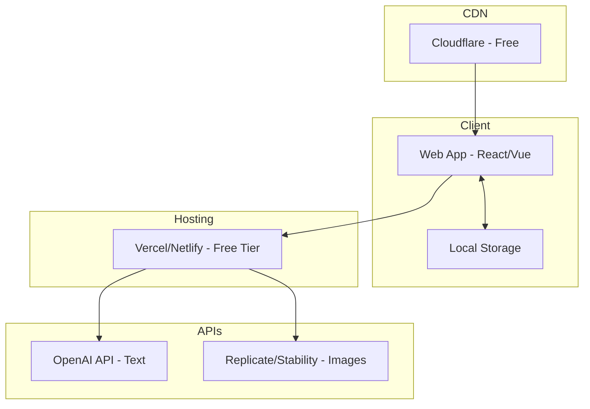
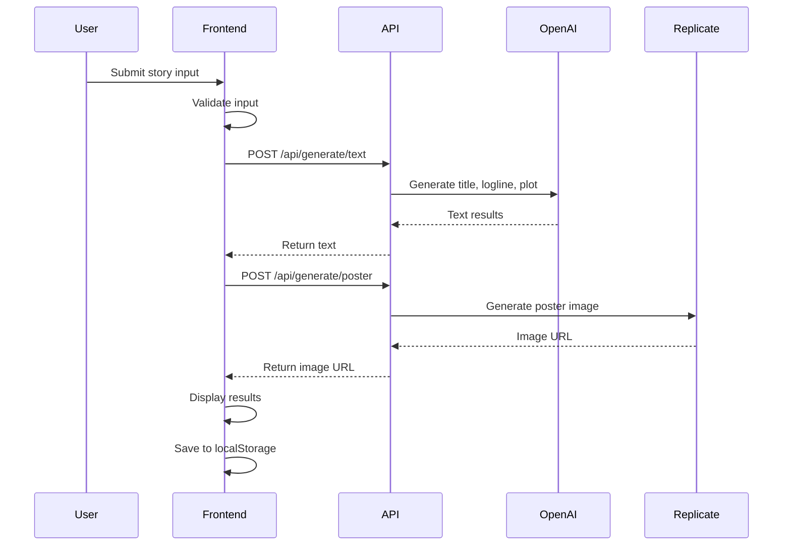
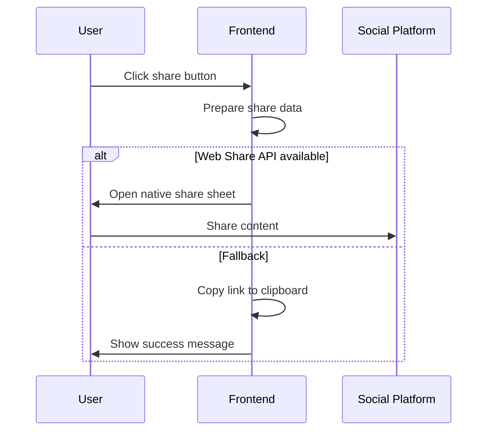

# Step 6: Technical Architecture & Development Plan

**Date:** 2026-02-23
**Status:** Completed
**Role:** Full-Stack Developer
**Subject:** CineLife Technical Architecture

---

## Executive Summary

This document outlines the complete technical architecture for CineLife MVP, designed for **zero-cost deployment** and **rapid development**. The architecture prioritizes simplicity, scalability, and leveraging free-tier services.

**Key Decision:** Static site with serverless functions - no backend server required.

---

## Architecture Overview

### High-Level Architecture



### Technology Stack

| Layer | Technology | Rationale |
|-------|------------|-----------|
| Frontend | React + Vite | Fast, modern, good DX |
| Styling | Tailwind CSS | Rapid development, design system |
| Hosting | Vercel | Free tier, auto-deploy, edge functions |
| Text AI | OpenAI GPT-4o-mini | Free tier available, quality output |
| Image AI | Replicate/FLUX | Free tier, quality posters |
| Analytics | Plausible/Umami | Privacy-focused, free self-hosted |

---

## Frontend Architecture

### Project Structure

```
cinelife/
├── public/
│   ├── favicon.ico
│   ├── og-image.png
│   └── robots.txt
├── src/
│   ├── components/
│   │   ├── ui/
│   │   │   ├── Button.jsx
│   │   │   ├── Input.jsx
│   │   │   ├── Card.jsx
│   │   │   └── Progress.jsx
│   │   ├── layout/
│   │   │   ├── Header.jsx
│   │   │   └── Footer.jsx
│   │   ├── features/
│   │   │   ├── InputWizard.jsx
│   │   │   ├── MovieDisplay.jsx
│   │   │   ├── PosterCard.jsx
│   │   │   └── ShareButtons.jsx
│   │   └── screens/
│   │       ├── LandingPage.jsx
│   │       ├── CreatePage.jsx
│   │       └── ResultsPage.jsx
│   ├── hooks/
│   │   ├── useMovieGeneration.js
│   │   └── useLocalStorage.js
│   ├── services/
│   │   ├── aiService.js
│   │   └── shareService.js
│   ├── utils/
│   │   ├── prompts.js
│   │   └── formatters.js
│   ├── styles/
│   │   └── globals.css
│   ├── App.jsx
│   └── main.jsx
├── api/
│   └── generate/
│       └── [type].js
├── package.json
├── vite.config.js
├── tailwind.config.js
└── vercel.json
```

### State Management

**Approach:** React Context + useReducer for global state, local state for components

```javascript
// State structure
const appState = {
  currentStep: 0,           // Wizard step
  userInput: {
    name: '',
    age: null,
    events: [],
    challenge: '',
    achievement: '',
    goal: '',
    people: [],
    mood: ''
  },
  movieResult: null,        // Generated movie
  isGenerating: false,
  error: null,
  regenerationsLeft: 2
};
```

### Routing

Using React Router for SPA navigation:

| Route | Component | Purpose |
|-------|-----------|---------|
| `/` | LandingPage | Homepage |
| `/create` | CreatePage | Input wizard |
| `/result/:id` | ResultsPage | View generated movie |

---

## API Integration

### AI Service Architecture

#### Text Generation (OpenAI)

```javascript
// api/generate/text.js
export default async function handler(req, res) {
  const { type, input } = req.body;

  const prompts = {
    title: `Generate a compelling movie title for a story about ${input.name},
            a ${input.age}-year-old who ${input.events.join(', ')}.
            Genre: ${input.mood}. Return only the title.`,

    logline: `Create a one-sentence Hollywood logline for a movie about ${input.name}.
              Key events: ${input.events.join(', ')}.
              Challenge: ${input.challenge}.
              Achievement: ${input.achievement}.
              Format: One sentence, under 30 words.`,

    plot: `Write a 3-act plot summary for a movie:
           Protagonist: ${input.name}, ${input.age}
           Act 1 Setup: ${input.events[0]}
           Act 2 Conflict: ${input.challenge}
           Act 3 Resolution: ${input.achievement}
           Format: Act 1: [2-3 sentences], Act 2: [3-4 sentences], Act 3: [2-3 sentences]`,

    characters: `Describe the main characters for a movie:
                 Protagonist: ${input.name}, ${input.age}
                 Supporting: ${input.people.join(', ')}
                 Format: JSON with name, role, and brief description for each.`
  };

  const response = await openai.chat.completions.create({
    model: 'gpt-4o-mini',
    messages: [{ role: 'user', content: prompts[type] }],
    max_tokens: 500
  });

  return res.json({ result: response.choices[0].message.content });
}
```

#### Image Generation (Replicate/FLUX)

```javascript
// api/generate/poster.js
export default async function handler(req, res) {
  const { title, genre, plotSummary } = req.body;

  const prompt = `Professional movie poster for "${title}".
                  Genre: ${genre}.
                  Style: Cinematic, theatrical release quality.
                  Mood: Dramatic lighting, compelling composition.
                  Text: Title "${title}" prominently displayed.
                  No faces, silhouette or symbolic imagery preferred.`;

  const response = await replicate.run(
    "black-forest-labs/flux-schnell",
    {
      input: {
        prompt: prompt,
        aspect_ratio: "2:3",
        output_quality: 90
      }
    }
  );

  return res.json({ imageUrl: response[0] });
}
```

### API Rate Limiting & Caching

```javascript
// Middleware for rate limiting
const rateLimiter = {
  windowMs: 60 * 1000,  // 1 minute
  max: 5                 // 5 requests per minute per IP
};

// Simple in-memory cache for repeated requests
const cache = new Map();
const CACHE_TTL = 3600000; // 1 hour
```

---

## Data Flow

### Generation Flow



### Sharing Flow



---

## Deployment Architecture

### Vercel Configuration

```json
// vercel.json
{
  "version": 2,
  "builds": [
    { "src": "package.json", "use": "@vercel/static-build" }
  ],
  "routes": [
    { "src": "/api/(.*)", "dest": "/api/$1" },
    { "src": "/(.*)", "dest": "/index.html" }
  ],
  "functions": {
    "api/**/*.js": {
      "memory": 1024,
      "maxDuration": 30
    }
  }
}
```

### Environment Variables

```bash
# Required environment variables
OPENAI_API_KEY=sk-...
REPLICATE_API_TOKEN=r8_...

# Optional
ANALYTICS_ID=...
```

### Free Tier Limits

| Service | Free Tier | Limits |
|---------|-----------|--------|
| Vercel | Hobby | 100GB bandwidth, 100 builds/day |
| OpenAI | Free credits | $5 credit, then pay-per-use |
| Replicate | Free tier | ~5000 predictions/month |

---

## Security Considerations

### API Key Protection

```javascript
// Never expose API keys on client
// All AI calls go through serverless functions

// api/generate/[type].js
export default async function handler(req, res) {
  // Verify request origin
  const origin = req.headers.origin;
  if (!allowedOrigins.includes(origin)) {
    return res.status(403).json({ error: 'Forbidden' });
  }

  // API key only on server
  const openai = new OpenAI({
    apiKey: process.env.OPENAI_API_KEY
  });

  // ... rest of logic
}
```

### Input Validation

```javascript
const validateInput = (input) => {
  const schema = {
    name: { type: 'string', maxLength: 50, required: true },
    age: { type: 'number', min: 1, max: 120, required: true },
    events: { type: 'array', maxLength: 10, required: true },
    // ... other fields
  };

  // Validate against schema
  // Sanitize HTML/JS injection
  // Return cleaned input or errors
};
```

### Rate Limiting

```javascript
// Simple IP-based rate limiting
const rateLimit = async (req, res, next) => {
  const ip = req.headers['x-forwarded-for'] || req.connection.remoteAddress;
  const key = `rate:${ip}`;

  const requests = await cache.get(key) || 0;
  if (requests > 10) {
    return res.status(429).json({ error: 'Too many requests' });
  }

  await cache.set(key, requests + 1, 60); // 60 second window
  next();
};
```

---

## Performance Optimization

### Frontend Performance

| Technique | Implementation |
|-----------|----------------|
| Code splitting | React.lazy for routes |
| Image optimization | Next/Image or lazy loading |
| CSS optimization | Tailwind purging |
| Bundle analysis | Vite bundle analyzer |
| Caching | Service worker for assets |

### API Performance

| Technique | Implementation |
|-----------|----------------|
| Response caching | Cache similar prompts |
| Parallel requests | Generate text + image simultaneously |
| Streaming | Stream text generation |
| Edge functions | Deploy APIs to edge |

### Target Metrics

| Metric | Target | Tool |
|--------|--------|------|
| Lighthouse | 90+ | Chrome DevTools |
| First Contentful Paint | <1.5s | Lighthouse |
| Time to Interactive | <3s | Lighthouse |
| Bundle size | <200KB | Vite |

---

## Development Workflow

### Local Development Setup

```bash
# Clone repository
git clone https://github.com/username/cinelife.git
cd cinelife

# Install dependencies
npm install

# Set up environment
cp .env.example .env.local
# Edit .env.local with API keys

# Run development server
npm run dev

# Run tests
npm test
```

### Git Workflow

```mermaid
gitgraph
    commit id: "init"
    branch develop
    checkout develop
    commit id: "setup"
    commit id: "landing"
    branch feature/input-wizard
    checkout feature/input-wizard
    commit id: "wizard"
    checkout develop
    merge feature/input-wizard
    branch feature/ai-integration
    checkout feature/ai-integration
    commit id: "ai"
    checkout develop
    merge feature/ai-integration
    checkout main
    merge develop tag: "v1.0.0"
```

### CI/CD Pipeline

```yaml
# .github/workflows/ci.yml
name: CI/CD
on: [push, pull_request]

jobs:
  test:
    runs-on: ubuntu-latest
    steps:
      - uses: actions/checkout@v3
      - uses: actions/setup-node@v3
      - run: npm ci
      - run: npm test
      - run: npm run build

  deploy:
    needs: test
    if: github.ref == 'refs/heads/main'
    runs-on: ubuntu-latest
    steps:
      - uses: actions/checkout@v3
      - uses: amondnet/vercel-action@v25
        with:
          vercel-token: ${{ secrets.VERCEL_TOKEN }}
          vercel-org-id: ${{ secrets.ORG_ID }}
          vercel-project-id: ${{ secrets.PROJECT_ID }}
```

---

## Error Handling

### Error Types

| Error | Code | User Message | Recovery |
|-------|------|--------------|----------|
| Invalid input | 400 | "Please check your input" | Show validation errors |
| Rate limited | 429 | "Too many requests, try again later" | Show countdown |
| AI failure | 502 | "Generation failed, please retry" | Retry button |
| Timeout | 504 | "Taking too long, please retry" | Retry button |

### Error Boundary

```jsx
// ErrorBoundary.jsx
class ErrorBoundary extends React.Component {
  state = { hasError: false };

  static getDerivedStateFromError(error) {
    return { hasError: true };
  }

  componentDidCatch(error, info) {
    logError(error, info);
  }

  render() {
    if (this.state.hasError) {
      return <ErrorFallback onRetry={() => window.location.reload()} />;
    }
    return this.props.children;
  }
}
```

---

## Monitoring & Analytics

### Analytics Events

| Event | Properties | Purpose |
|-------|------------|---------|
| `page_view` | page, referrer | Traffic analysis |
| `wizard_start` | - | Conversion funnel |
| `wizard_complete` | time_spent | Completion rate |
| `generation_start` | - | API usage |
| `generation_complete` | time, success | Performance |
| `share_click` | platform | Viral tracking |
| `regenerate_click` | type | Satisfaction |

### Error Tracking

```javascript
// Simple error logging
const logError = async (error, context) => {
  console.error(error);

  // Send to logging service (free tier)
  await fetch('/api/log', {
    method: 'POST',
    body: JSON.stringify({
      error: error.message,
      stack: error.stack,
      context,
      timestamp: new Date().toISOString()
    })
  });
};
```

---

## Development Timeline

### Week 1: Foundation

| Day | Tasks |
|-----|-------|
| 1-2 | Project setup, design system implementation |
| 3-4 | Landing page, input wizard UI |
| 5 | API integration skeleton |

### Week 2: Core Features

| Day | Tasks |
|-----|-------|
| 6-7 | AI generation integration |
| 8 | Results display, sharing |
| 9 | Testing, bug fixes |
| 10 | Deployment, soft launch |

---

## Reflection

**What went well:**
- Zero-cost architecture is achievable
- Clear separation of concerns
- Scalable serverless approach

**Issues identified:**
- OpenAI free tier may not be enough for viral launch
- Need fallback for image generation
- Should implement caching early

**Technical Risks:**
1. API rate limits during viral growth
2. Image generation quality consistency
3. No persistent storage for results

**Mitigations:**
1. Implement aggressive caching
2. Multiple AI provider fallbacks
3. LocalStorage + shareable links

---

*Document created by Full-Stack Developer*
